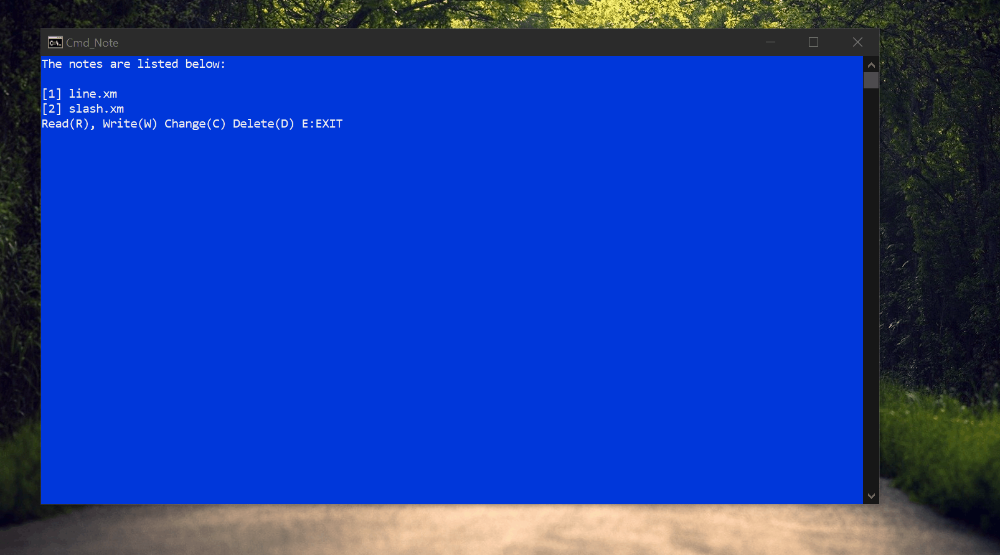
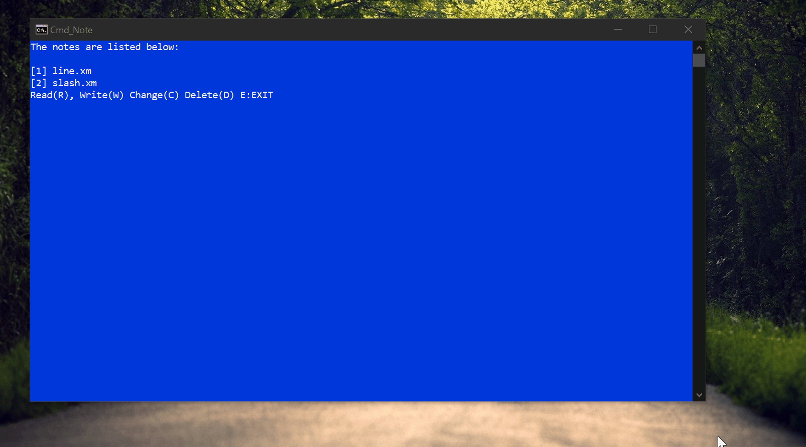

# What is it

A text interpreter for windows command line ***cmd/powershell***.



# Usage

#### Four options for file operation:

- Read

- Write

- Change

- Delete

#### And three commands for interpretting:

- #line



- #slash


- #endl

# Why did you made such a thing

I had free time and was looking for a project then this happened. ;)

# Warning!

Until recently Windows 10 (which was the only one btw.) was supporting Utf-8 command ```CHCP 65001```. <u>But now it makes the program crash.</u> Because of this terminal only supports english.
