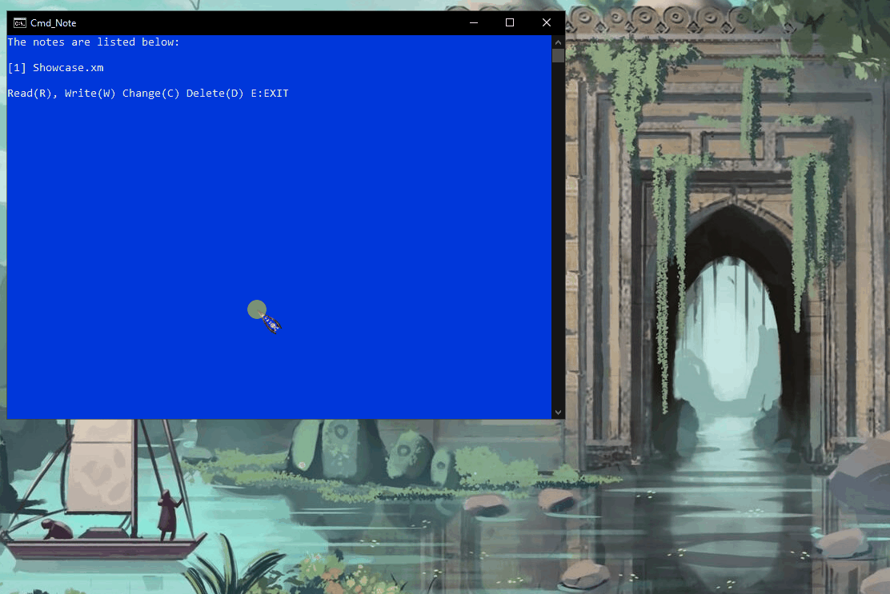

# CMD_NOTE

A text interpreter for windows command line ***cmd/powershell***.

# Usage

After making your first note a notepad will open. You can type the below commands **(one per line with no other writing)**.

# Commands

###### (Case sensitive and must be aligned left.)

- ###### *#color [args] (e.g. color 4f)*
  
  - Changes the color of the terminal.
  
  - If no arguments given it will display the available colors.

- ###### *#pause*
  
  - Pauses the writing until a key press.
  
  - Can be used for multiple color sections or paging the text.

- ###### *#new*
  
  - Prints blank line. 

- ###### *#line*
  
  - Prints "-" to the end of line.

- ###### *#slash*
  
  - Prints "/" to the end of line.

- ###### *#dots*
  
  - Prints "." to the end of line.

- ###### *#star*
  
  - Prints "*" to the end of line.

## Warning!

Do not uncomment "UTF-8" `CHCP 65001`.  This line causes crash.
